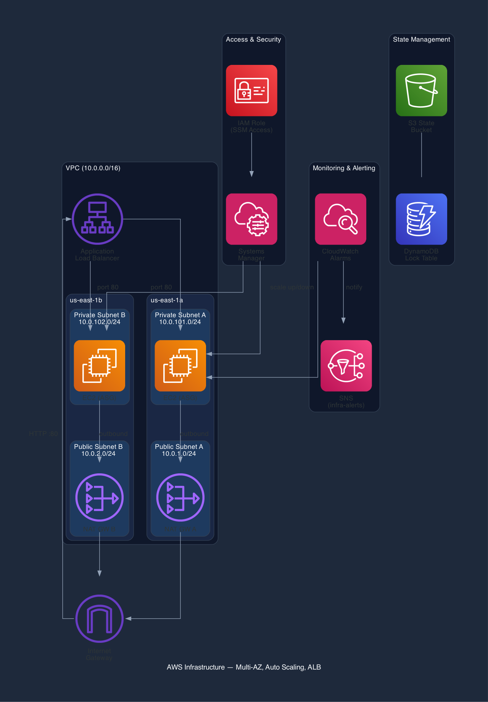

# AWS Infrastructure with Terraform — Multi-AZ, Auto Scaling, ALB


---

Provisioned a production-style, highly available AWS infrastructure using Terraform with reusable modules. Multi-AZ networking with public/private subnets, an Auto Scaling Group behind an Application Load Balancer, NAT Gateways for private subnet egress, IAM roles for secure SSM access, and remote state management with S3 + DynamoDB locking. CloudWatch metric alarms drive auto scaling policies and push notifications to SNS for operational alerting. Infrastructure is deployed and destroyed via GitHub Actions CI/CD with OIDC authentication — no static credentials.

---

## Architecture



---

## What This Provisions

**Networking**
- VPC with `10.0.0.0/16` CIDR
- 2 public subnets across `us-east-1a` and `us-east-1b`
- 2 private subnets across `us-east-1a` and `us-east-1b`
- Internet Gateway for public subnet internet access
- NAT Gateway per AZ for private subnet outbound traffic
- Route tables with proper public/private routing

**Compute**
- Launch Template with Amazon Linux 2023 AMI and user data bootstrapping
- Auto Scaling Group (min: 2, desired: 2, max: 4) with ELB health checks
- Instances deployed in private subnets only

**Load Balancing**
- Application Load Balancer in public subnets
- Target Group with HTTP health checks (15s interval, 2 healthy/unhealthy thresholds)
- HTTP listener forwarding to target group

**Auto Scaling Policies**
- Scale-up policy — adds 1 instance when triggered, 60s cooldown
- Scale-down policy — removes 1 instance when triggered, 60s cooldown

**Monitoring & Alerting**
- CloudWatch alarm on ASG average CPU > 70% (2 consecutive periods) → triggers scale-up + SNS notification
- CloudWatch alarm on ASG average CPU < 20% (2 consecutive periods) → triggers scale-down + SNS notification
- SNS topic with email subscription for infrastructure alerts

**Security**
- ALB security group — accepts port 80 from the internet
- App security group — accepts port 80 from the ALB security group only (no direct access)
- IAM role + instance profile with SSM access (no SSH keys, port 22 closed)

**State Management**
- S3 bucket with versioning for Terraform state
- DynamoDB table for state locking
- Bootstrapped separately from main infrastructure

**CI/CD**
- GitHub Actions pipeline: `init → fmt → validate → plan → apply` on push to `main`
- `terraform plan` on pull requests for review
- Manual `terraform destroy` workflow via `workflow_dispatch`
- OIDC authentication to AWS — no static access keys stored in GitHub

---

## Project Structure

```
terraform-aws-infra-deep-dive/
├── .github/workflows/
│   ├── terraform.yml            # CI/CD: plan on PR, apply on merge to main
│   └── terraform-destroy.yml    # Manual destroy workflow
├── bootstrap-backend/
│   ├── main.tf                  # S3 bucket + DynamoDB lock table
│   └── variables.tf
├── envs/
│   └── dev/
│       ├── main.tf              # Dev environment resources (ASG, ALB, IAM, SGs)
│       ├── variables.tf
│       ├── outputs.tf
│       └── terraform.tfvars
└── modules/
    └── network/
        ├── main.tf              # VPC, subnets, IGW, NAT GWs, route tables
        ├── variables.tf
        └── outputs.tf
```

---

## Key Design Decisions

**Private subnets for compute** — Application instances have no public IPs and are unreachable from the internet. Only the ALB can forward traffic to them, reducing attack surface.

**NAT Gateway per AZ** — If one AZ fails, the other retains independent outbound connectivity. Single NAT is cheaper but creates a cross-AZ dependency.

**Security group chaining** — App SG references ALB SG as its source instead of a CIDR block. Traffic to app instances can only originate from the ALB.

**SSM over SSH** — IAM-controlled access with CloudTrail audit logging. No SSH key management, no port 22.

**Reusable network module** — Same module can provision dev, staging, and prod environments with different CIDR ranges and subnet configurations.

**OIDC for GitHub Actions** — Short-lived credentials via AWS STS. No long-lived access keys stored as GitHub secrets.

---

## Usage

### 1. Bootstrap the backend (one-time)

```bash
cd bootstrap-backend
terraform init
terraform apply
```

### 2. Deploy infrastructure

```bash
cd envs/dev
terraform init
terraform plan
terraform apply
```

Or push to `main` and GitHub Actions will handle it.

### 3. Tear down

```bash
cd envs/dev
terraform destroy
```

Or trigger the `Terraform Destroy` workflow manually in GitHub Actions.

---

## Technologies

- **Terraform** — Infrastructure as Code
- **AWS** — VPC, EC2, ALB, ASG, CloudWatch, SNS, IAM, S3, DynamoDB, NAT Gateway, SSM
- **GitHub Actions** — CI/CD with OIDC authentication

---

**Author:** [Gerard Eklu](https://github.com/gerardinhoo)
